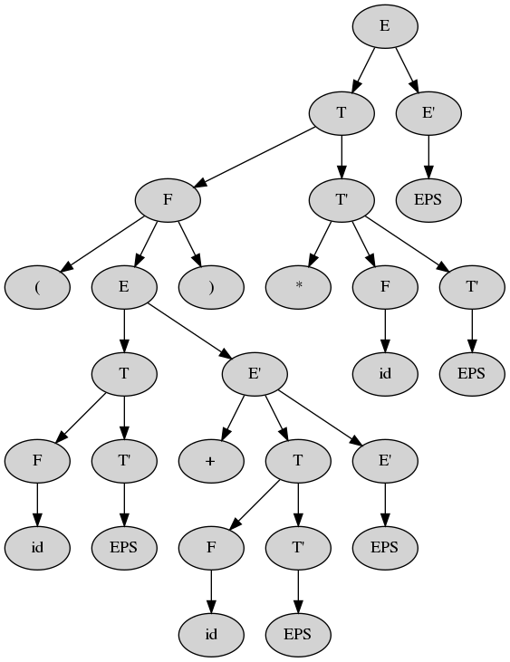

# LL(1), SLR(1), LALR(1), LR(1) parser generators
Crude (but operational) parser generators for a subclass of context-free grammars. Mostly to make sure I understand what's going on.

### Examples
Leftmost parse tree for `(id + id) * id` according to LL(1)-grammar for simplified regular expression

